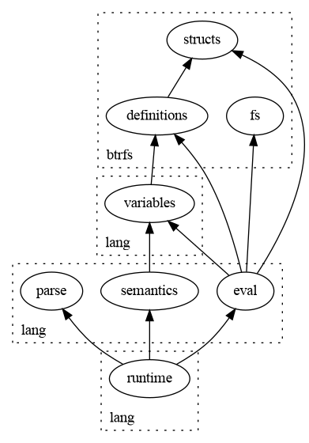

### Directories

* `btrfs`
  * Contains btrfs specific code
* `lang`
  * Contains generic language code

### Modules

* `lang/functions.rs`
* `lang/structs.rs`
* `lang/variables.rs`

Manages functions, structs, and variable lifetimes.

* `lang/ast.rs`
* `lang/eval.rs`
* `lang/parse.rs`
* `lang/semantics.rs`

Generic language modules. Abstract syntax tree data structure, runtime
evaluation, AST parsing, and semantic analysis.
